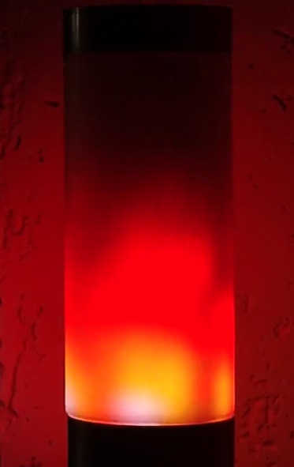

# Matrix-Fire-Parus: Динамическая симуляция огня для LED матрицы на ESPHome

 

<p align="center">
    
    
    
    
</p>
## 🌟 Описание Проекта

**Динамическая симуляция огня на светодиодной матрице**

Этот проект представляет собой реализацию визуального эффекта огня с помощью светодиодной матрицы, создает реалистичное изображение пылающего огня с динамическими изменениями цвета и яркости. Используя алгоритмы моделирования тепловых процессов, проект имитирует распространение тепла, вспышки искр и изменение цветов, что позволяет добиться эффекта живого, мерцающего пламени.

**Ключевые особенности**

Динамическое моделирование тепла: тепловая карта обновляется каждый кадр, учитывая охлаждение, распространение и возникновение искр.
Реалистичные цветовые градиенты: цвета огня плавно переходят от горячих желтых и оранжевых до холодных синих и фиолетовых оттенков.
Параметры настройки: возможность регулировать скорость огня, наличие искр, ориентацию пламени, яркость и градиенты для достижения желаемого визуального эффекта.
Поддержка различных ориентаций: огонь может отображаться в различных направлениях, позволяя адаптировать его к разным формам и расположениям светодиодной системы.
Эффекты углей и искр: дополнительные визуальные детали придают проекту более реалистичный и живой вид.
Этот проект предназначен для демонстрации возможностей работы с LED-экраном, моделирования природных процессов и может быть использован для создания эффектных инсталляций, декораций или декоративных элементов в интерьере.

Основные возможности:
- **Настройка параметров эффекта с помощью слайдеров**: возможность регулировать скорость огня, наличие искр, ориентацию пламени, яркость и градиенты для достижения желаемого визуального эффекта.
- **Ручная тонкая настройка корректировкой кода**: Комментарии в коде позволяют точно настроить желаемый оттенок эффекта.
- **Интеграция**: Полная совместимость с проектом Matrix-Lamp https://github.com/andrewjswan/matrix-lamp.

Проект основан на ESP32-C3 (или любой ESP32).

---

## 🚀 Ключевые Функции

### Динамическое моделирование тепла
- тепловая карта обновляется каждый кадр.
- учитывая охлаждение (настраиваемое).
- возникновение и распространение искр.
- изменение положения матрицы.

---

### Программные Зависимости
- **ESPHome**: Версия 2024+.

---

## 📋 Установка и Настройка

### 3. Настройка ESPHome
- Внесите код из файла проекта в основной файл ESPHome в качестве эффекта `addressable_lambda:` либо через include.
- Измените substitutions в начале файла под вашу конфигурацию
- При использовании вне проекта Matrix-Lamp добавьте number, указанные ниже в README

## 🔧 Расширенная Настройка

### Substitutions
Настройте параметры в начале YAML:
- ${width_leds};
- ${height_leds};

### Слайдеры для управления и настройки.
Для использование с проектом Matrix-Lamp https://github.com/andrewjswan/matrix-lamp они уже существуют в проекте.
Для использования вне Matrix-Lamp прокта нужно добавить эти компоненты в главный файл Вашего прокта.
```yaml
number:
  # Matrix Orientation
  - platform: template
    name: Matrix Orientation
    icon: mdi:autorenew
    min_value: 1
    max_value: 8
    step: 1
    optimistic: true
    id: matrix_orientation
    initial_value: 2
    mode: slider
    entity_category: config
    disabled_by_default: true
    restore_value: true
 # Matrix Settings
  - platform: template
    name: Effect Intensity
    icon: mdi:spotlight
    min_value: 0
    max_value: 255
    step: 1
    optimistic: true
    id: matrix_intensity
    initial_value: 128
    mode: slider
    entity_category: config
  - platform: template
    name: Effect Speed
    icon: mdi:speedometer
    min_value: 0
    max_value: 255
    step: 1
    optimistic: true
    id: matrix_speed
    initial_value: 128
    mode: slider
    entity_category: config
  - platform: template
    name: Effect Scale
    icon: mdi:drag-variant
    min_value: 0
    max_value: 100
    step: 1
    optimistic: true
    id: matrix_scale
    initial_value: 50
    mode: slider
    entity_category: config
```
---

## 📊 Скриншоты и Видео

- [yaml файл прошивки](matrix_fire_parus.yaml)
- [Скриншот](matrix-fire-parus.jpg)
- [Видео YOUTUBE](https://www.youtube.com/shorts/WEGVUN41hac)

---

##  Дополнительные источники информации

Телеграм канал https://t.me/parus_smart

---
## 🙏 Благодарности

- ESPHome сообществу за отличный фреймворк.
- Home Assistant за интеграцию.
- [@andrewjswan](https://github.com/andrewjswan) за отличный проект [matrix-lamp](https://github.com/andrewjswan/matrix-lamp)
- Вам за использование! Если проект полезен, поставьте ⭐ на GitHub.

---

*Создано с ❤️ ParusSmartHome. Версия: 26.12.2025*

